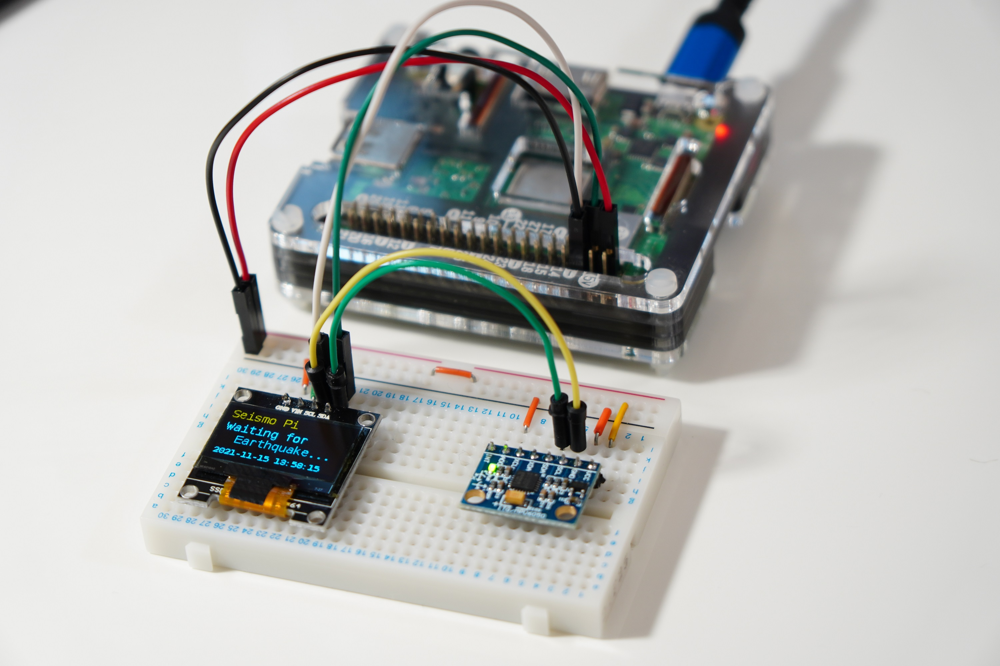
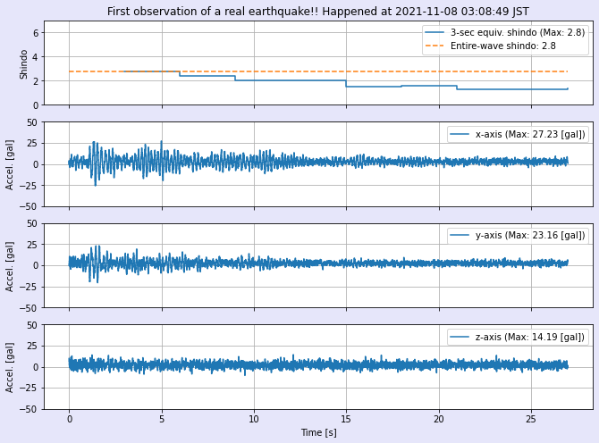

# seismopi
Seismometer by Raspberry Pi

## Introduction
Turn your Raspberry Pi a seismometer by connecting a motion sensor!

The Python program, seismopi.py in this repository acquires acceleration data from the motion sensor and calculates the JMA instrumental seismic intensity.

## How it looks like
See photo below. A motion sensor, Invensense MPU6050, and an OLED display is connected to Raspberry Pi via the I2C bus.

**The photo above looks like that two I2C slave devices, MPU6050 and the OLED display, are parallel-connected to the common I2C bus. However, such an arrangement disrupts periodical sampling of acceleration from MPU6050 every 10 milliseconds. Thus, the current version of seismopi.py separates the I2C bus for each I2C slave device by utilizing the bit-bang I2C driver included in Linux. The new I2C bus looks the same way from pigpio library.

## Record example
Below is a record of real earthquake which happend at 3:08 am on November 8, 2021 in Japan. The calculated JMA seismic intensity was 2.8.

## Shindo calculation
The Japan Meteorological Agency's instrumental seisminc intensity, *shindo*, is calculated by shindo.py, which is in this repositoty as well as in the following.

https://github.com/RR-Inyo/shindo
